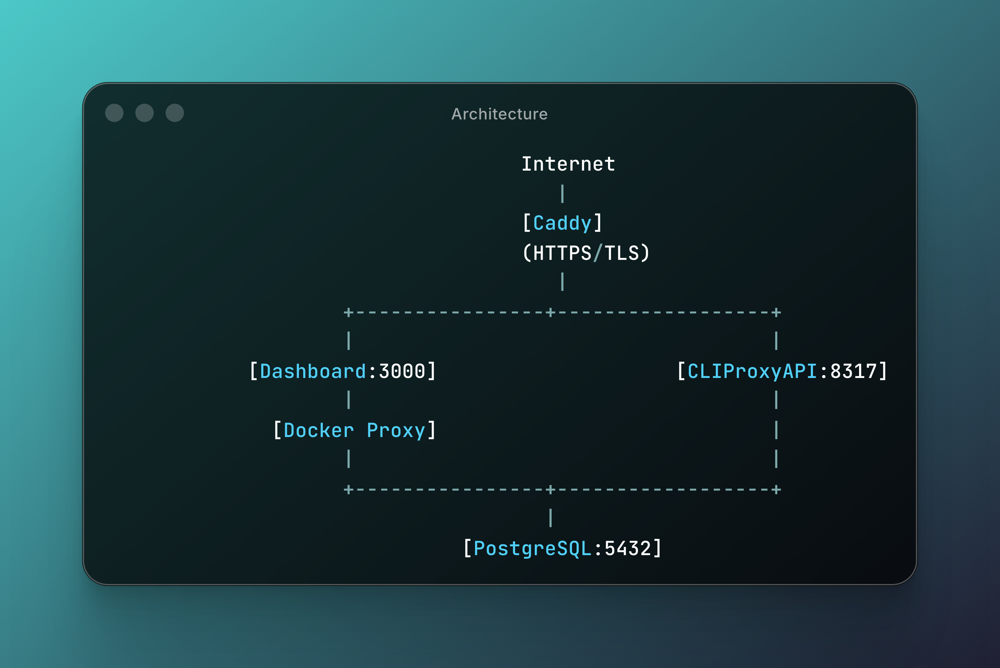
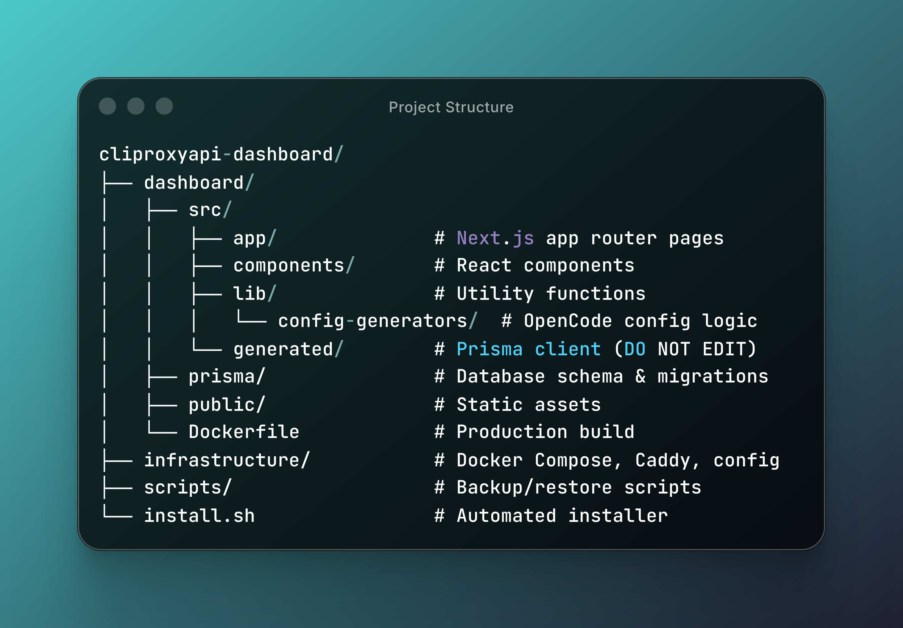

<p align="center">
  
</p>

<h1 align="center">CLIProxyAPI Dashboard</h1>

<p align="center">
  <strong>Use Claude Code, Gemini CLI, and Codex as OpenAI-compatible APIs — managed through a modern web dashboard.</strong>
</p>

<p align="center">
  <a href="https://github.com/itsmylife44/cliproxyapi-dashboard/releases"></a>
  <a href="https://github.com/itsmylife44/cliproxyapi-dashboard/actions/workflows/release.yml"></a>
  <a href="https://github.com/itsmylife44/cliproxyapi-dashboard/pkgs/container/cliproxyapi-dashboard%2Fdashboard"></a>
  <a href="LICENSE"></a>
  <a href="https://discord.gg/RngVxcNvfg"></a>
  
  
  
</p>

---

<p align="center">
  <a href="https://discord.gg/RngVxcNvfg">
    
  </a>
</p>
<p align="center">
  We have a Discord server — installation help, release announcements, and community chat.<br>
  <strong><a href="https://discord.gg/RngVxcNvfg">discord.gg/RngVxcNvfg</a></strong>
</p>

---

## What is this?

[CLIProxyAPIPlus](https://github.com/router-for-me/CLIProxyAPIPlus) wraps OAuth-based CLI tools (Claude Code, Gemini CLI, Codex, GitHub Copilot, Kiro, Antigravity, Kimi, Qwen) into **OpenAI-compatible APIs**. This dashboard gives you a web UI to manage everything — providers, API keys, configs, logs, and updates — without touching YAML files.

## Quick Start

> **Local use (macOS/Windows/Linux)**: Only Docker Desktop required.

```bash
git clone https://github.com/itsmylife44/cliproxyapi-dashboard.git
cd cliproxyapi-dashboard
./setup-local.sh          # macOS/Linux
# .\setup-local.ps1       # Windows
```

Open **http://localhost:3000** → create admin account → done.

> **Server deployment**: See the full [Installation Guide](docs/INSTALLATION.md).

## Features

- **Visual Configuration** — Manage CLIProxyAPIPlus settings through structured forms, no YAML editing
- **Multi-Provider OAuth** — Connect Claude, Gemini, Codex, Copilot, Kiro, Antigravity, iFlow, Kimi, and Qwen accounts
- **Custom Providers** — Add any OpenAI-compatible endpoint (OpenRouter, Ollama, etc.) with model mappings
- **API Key Management** — Create, revoke, and track API keys with per-user ownership
- **Real-time Monitoring** — Live log streaming, container health, and service management
- **Quota Tracking** — Rate limits and usage per provider (Claude, Codex, Kimi, Antigravity)
- **Telegram Quota Alerts** — Automatic notifications when OAuth quota drops below threshold (configurable per-provider, 1-hour cooldown)
- **Usage Analytics** — Request counts, provider breakdown, model stats, error rates
- **Oh-My-Open-Agent Variant Toggle** — Choose between [oh-my-openagent](https://github.com/code-yeongyu/oh-my-openagent) (9 agents + categories) and [oh-my-opencode-slim](https://github.com/alvinunreal/oh-my-opencode-slim) (6 agents, lower tokens, fallback chains) with per-agent model/skills configuration
- **Config Sync** — Auto-sync OpenCode configs via the [`opencode-cliproxyapi-sync`](https://github.com/itsmylife44/opencode-cliproxyapi-sync) plugin (includes slim config)
- **Config Sharing** — Share model configs with others via share codes (`XXXX-XXXX`)
- **One-Click Updates** — Update both Dashboard (GHCR) and CLIProxyAPIPlus (Docker Hub) from the admin panel
- **Container Management** — Start, stop, restart containers directly from the UI
- **Automatic TLS** — Let's Encrypt certificates via Caddy, auto-renewed

## Telegram Quota Alerts

Get notified on Telegram when your OAuth provider quota is running low.

**Setup** (Admin → Settings → Telegram Alerts):

1. Create a Telegram bot via [@BotFather](https://t.me/BotFather) and copy the bot token
2. Get your chat ID (send a message to the bot, then check `https://api.telegram.org/bot<TOKEN>/getUpdates`)
3. In the dashboard, go to **Admin → Settings → Telegram** and enter:
   - Bot token
   - Chat ID
   - Quota threshold (e.g. 20% remaining)
   - Which providers to monitor (Claude, Codex, Kimi, Antigravity)
4. Enable alerts — the scheduler checks every 5 minutes with a 1-hour cooldown between notifications

Use the **Test Message** button to verify your configuration before enabling.

## Oh-My-Open-Agent Integration

The dashboard supports two OpenCode orchestration variants. Toggle between them in the **Using with OpenCode** section:

| Variant | Agents | Description |
|---------|--------|-------------|
| **Oh-My-Open-Agent** | 9 agents + 8 categories | Full-featured orchestration with sisyphus, atlas, prometheus, oracle, and more |
| **Oh-My-OpenCode Slim** | 6 agents | Lightweight: orchestrator, oracle, designer, explorer, librarian, fixer. Lower token usage with dedicated fallback chains |

**How it works:**

1. Select your variant in the dashboard -- the plugin in `opencode.json` switches automatically
2. Assign models to agents (auto-assigned by tier, or manually override)
3. Toggle skills per agent (simplify, cartography, agent-browser)
4. Config syncs automatically via the sync plugin

**First-time setup** (run once per variant):

```bash
bunx oh-my-openagent@latest install          # Normal variant
bunx oh-my-opencode-slim@latest install     # Slim variant
```

Each variant has its own config file (`oh-my-openagent.json` / `oh-my-opencode-slim.json`) -- they don't conflict.

## Screenshots

<p align="center">
  
</p>

<p align="center">
  
</p>

## Architecture

Six Docker containers, two isolated networks:

<p align="center">
  
</p>

| Service | Role |
|---------|------|
| **Caddy** | Reverse proxy, automatic TLS, HTTP/3 |
| **Dashboard** | Next.js web app, JWT auth, Docker management via socket proxy |
| **CLIProxyAPIPlus** | AI proxy server, OAuth callbacks, management API |
| **Perplexity Sidecar** | OpenAI-compatible wrapper for Perplexity Pro subscription |
| **Docker Socket Proxy** | Restricted Docker API access (containers/images only) |
| **PostgreSQL** | Database on isolated internal network |

## Project Structure

<p align="center">
  
</p>

## Tech Stack

| Component | Technology |
|-----------|-----------|
| Framework | Next.js 16 (App Router) |
| UI | React 19 |
| Styling | Tailwind CSS v4 |
| Database | PostgreSQL 16 + Prisma 7 |
| Auth | JWT (jose) + bcrypt |
| Container Mgmt | Docker CLI via socket proxy |

## Development

```bash
cd dashboard
./dev-local.sh              # Start dev environment
./dev-local.sh --reset      # Reset database
./dev-local.sh --down       # Stop containers
```

Or manually:

```bash
cd dashboard
npm install
cp .env.example .env.local  # Edit with your DB credentials
npx prisma migrate dev
npm run dev
```

Dashboard at `http://localhost:3000`.

## Documentation

| Guide | Description |
|-------|-------------|
| **[Installation](docs/INSTALLATION.md)** | Server deployment, local setup, manual installation |
| **[Configuration](docs/CONFIGURATION.md)** | Environment variables, config.yaml, config sync |
| **[Troubleshooting](docs/TROUBLESHOOTING.md)** | Common issues and solutions |
| **[Security](docs/SECURITY.md)** | Best practices for production |
| **[Backup & Restore](docs/BACKUP.md)** | Automated and manual backups |
| **[Service Management](docs/SERVICE-MANAGEMENT.md)** | Systemd and Docker Compose commands |

## Contributing

1. Fork → feature branch → PR
2. Use [Conventional Commits](https://www.conventionalcommits.org/) (`feat:`, `fix:`, `chore:`)
3. Test locally before submitting

Release-Please auto-generates releases from commit messages.

## Support

- **[Discord](https://discord.gg/RngVxcNvfg)** — Community chat, installation help, announcements
- **[CLIProxyAPIPlus](https://github.com/router-for-me/CLIProxyAPIPlus)** — Core proxy documentation
- **[Issues](https://github.com/itsmylife44/cliproxyapi-dashboard/issues)** — Bug reports and feature requests
- **[Discussions](https://github.com/itsmylife44/cliproxyapi-dashboard/discussions)** — Questions and community

## Star History

<a href="https://star-history.com/#itsmylife44/cliproxyapi-dashboard&Date">
  <picture>
    <source media="(prefers-color-scheme: dark)" srcset="https://api.star-history.com/svg?repos=itsmylife44/cliproxyapi-dashboard&type=Date&theme=dark" />
    <source media="(prefers-color-scheme: light)" srcset="https://api.star-history.com/svg?repos=itsmylife44/cliproxyapi-dashboard&type=Date" />
    
  </picture>
</a>

## License

[MIT](LICENSE)

---

<p align="center">
  Built with ❤️ using Next.js, React, and Tailwind CSS
</p>
