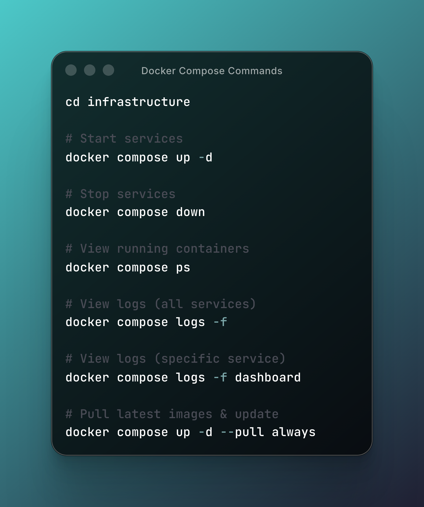

# Service Management

← [Back to README](../README.md)

## Systemd Commands

```bash
# Start the stack
sudo systemctl start cliproxyapi-stack

# Stop the stack
sudo systemctl stop cliproxyapi-stack

# Restart the stack
sudo systemctl restart cliproxyapi-stack

# View status
sudo systemctl status cliproxyapi-stack

# Enable auto-start on boot
sudo systemctl enable cliproxyapi-stack

# Disable auto-start
sudo systemctl disable cliproxyapi-stack
```

## Runtime Bundle Location

Production installs managed by `install.sh` run from:

```bash
/opt/cliproxyapi
```

Important files:

- `/opt/cliproxyapi/.env`
- `/opt/cliproxyapi/docker-compose.yml`
- `/opt/cliproxyapi/config/config.yaml`
- `/opt/cliproxyapi/metadata/install-info.env`

## Low-Level Docker Compose Commands

Use the commands below from `/opt/cliproxyapi` for start/stop/log inspection or manual troubleshooting.

```bash
cd /opt/cliproxyapi

# Start services
docker compose --env-file .env -f docker-compose.yml up -d

# Stop services
docker compose --env-file .env -f docker-compose.yml down

# Restart services
docker compose --env-file .env -f docker-compose.yml restart

# View running containers
docker compose --env-file .env -f docker-compose.yml ps

# View logs (all services)
docker compose --env-file .env -f docker-compose.yml logs -f

# View logs (specific service)
docker compose --env-file .env -f docker-compose.yml logs -f caddy
docker compose --env-file .env -f docker-compose.yml logs -f cliproxyapi
docker compose --env-file .env -f docker-compose.yml logs -f dashboard
docker compose --env-file .env -f docker-compose.yml logs -f postgres
docker compose --env-file .env -f docker-compose.yml logs -f perplexity-sidecar

# Execute command in container
docker compose --env-file .env -f docker-compose.yml exec cliproxyapi sh
docker compose --env-file .env -f docker-compose.yml exec dashboard sh
docker compose --env-file .env -f docker-compose.yml exec postgres psql -U cliproxyapi -d cliproxyapi

# Pull newer images
docker compose --env-file .env -f docker-compose.yml pull

# Recreate services manually after a targeted compose change
docker compose --env-file .env -f docker-compose.yml up -d
```

If you use `docker compose down` directly, treat it as a continuity-breaking operation because it stops `cliproxyapi`, `postgres`, and the rest of the stack together.

If the host was installed in **external/custom PostgreSQL** mode, the bundled `postgres` service should remain inert. Use these Compose commands for the rest of the production stack, but perform database backups/restores through your external PostgreSQL tooling rather than through bundled helpers.

If the host was installed in **Cloudflare Tunnel** mode, manage the tunnel service separately:

```bash
sudo systemctl status cloudflared
sudo systemctl restart cloudflared
```


